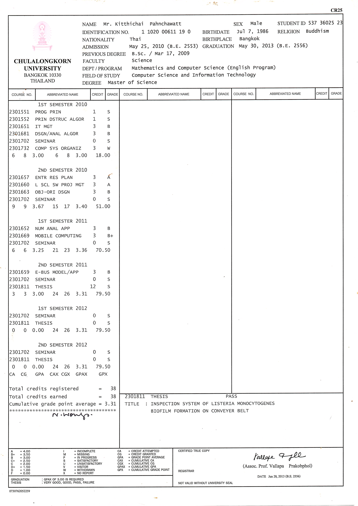

# Typhoon OCR Lib

A thin, typed Python wrapper around **Typhoon OCR** that focuses on:

- A simple `OCRClient` class for programmatic OCR
- A CLI (`typhoon-ocr`) for running OCR on PDFs and images
- A test suite with unit tests and E2E-style tests (fake and real backend)

All OCR heavy lifting is delegated to the official `typhoon-ocr` package. This library focuses on clean API design, error handling, and testability.

---

## Tech Stack

### Runtime & Language
- Python **3.9+**
- Virtual environments via **`venv`**

### Core Libraries
- **`typhoon-ocr`** – OCR pipeline and Typhoon LLM integration (PDF and image preprocessing, prompt construction, API calls)
- **`pydantic` v2** – typed request and response models (`OCRRequest`, `OCRResponse`) and validation

### Application Layer
- Custom package: **`typhoon_ocr_lib`**
  - `OCRClient` – thin, typed wrapper around `typhoon_ocr.ocr_document`
  - Environment-based config via `TYPHOON_OCR_API_KEY`
  - `argparse`-based CLI (`typhoon_ocr_lib.cli:main`)

### Build & Packaging
- `pyproject.toml` (PEP 621)
- Build backend: `setuptools.build_meta`
- Editable install: `pip install -e .`
- Console script:

```toml
[project.scripts]
typhoon-ocr = "typhoon_ocr_lib.cli:main"
```

### Testing & Quality
- **pytest** – unit and integration tests
- **pytest-cov** – optional coverage reports
- E2E-style tests:
  - `@pytest.mark.e2e` – CLI → client → *fake* backend (no network)
  - `@pytest.mark.e2e_real` – CLI → client → *real* Typhoon OCR API and Poppler (for PDFs)

### External Dependencies
- **Typhoon OCR API** (via `TYPHOON_OCR_API_KEY`)
- Optional for PDFs: **Poppler utilities** (`pdftoppm`, `pdfinfo`) on `PATH`

---

## Project Layout

```text
typhoon_ocr_lib/
├── pyproject.toml
├── README.md
├── src/
│   └── typhoon_ocr_lib/
│       ├── __init__.py
│       ├── client.py
│       ├── models.py
│       └── cli.py
└── tests/
    ├── test_models.py
    ├── test_client.py
    ├── test_cli.py
    └── test_e2e_cli.py
```

---

## Requirements

- **Python**: 3.9+ (tested with Python 3.13.5)
- **Typhoon OCR API key**: via `TYPHOON_OCR_API_KEY` environment variable
- For **PDFs** (optional, but required for real E2E on PDFs): Poppler utilities on `PATH`:
  - Windows: install a Poppler build and add `pdftoppm` and `pdfinfo` to `PATH`
  - macOS: `brew install poppler`
  - Ubuntu or Debian: `apt-get install poppler-utils`

> Image OCR (JPG and PNG) works **without** Poppler. Poppler is only required for PDFs.

---

## Installation

### 1. Create and activate virtual environment

Example directory layout:

```text
C:/Users/you/Documents/typhoon/
├── .venv/
└── typhoon_ocr_lib/
```

#### Windows (PowerShell)

```powershell
cd C:/Users/you/Documents/typhoon
python -m venv .venv
. ./.venv/Scripts/Activate.ps1

cd ./typhoon_ocr_lib
```

#### macOS or Linux

```bash
cd /path/to/typhoon
python -m venv .venv
source .venv/bin/activate
cd typhoon_ocr_lib
```

You will know the venv is active when your prompt starts with `(.venv)`.

### 2. Install the package (editable) and test tools

```bash
pip install -e .
pip install pytest pytest-cov
```

---

## Configuration: API Key

Set your Typhoon OCR API key in the environment.

#### PowerShell (Windows)

```powershell
$env:TYPHOON_OCR_API_KEY = "sk-your-typhoon-key"
```

#### bash or zsh (macOS or Linux)

```bash
export TYPHOON_OCR_API_KEY="sk-your-typhoon-key"
```

The library uses this automatically. You can also pass `api_key="..."` directly to `OCRClient(...)` if you prefer.

To confirm the key is visible inside Python:

```bash
python -c "import os; print(os.getenv('TYPHOON_OCR_API_KEY'))"
```

---

## CLI Usage

The main CLI entrypoint is the console script **`typhoon-ocr`** defined in `pyproject.toml`:

```toml
[project.scripts]
typhoon-ocr = "typhoon_ocr_lib.cli:main"
```

After `pip install -e .`, you can run:

```bash
typhoon-ocr --help
```

By default, use the `typhoon-ocr` command.

> `python -m typhoon_ocr_lib.cli` will only work if you add the following at the bottom of `cli.py`:
>
> ```python
> if __name__ == "__main__":
>     main()
> ```

### Example: Image input (no Poppler required)

Windows example using a real file:

```powershell
cd C:/Users/you/Documents/typhoon/typhoon_ocr_lib
$env:TYPHOON_OCR_API_KEY = "sk-your-typhoon-key"

typhoon-ocr "C:/Users/BOM/OneDrive/Documents/master.jpg" `
  --task-type structure `
  --format md `
  > master_ocr.md
```

This produces `master_ocr.md` in the repo directory with the Markdown OCR output.

For JSON instead:

```powershell
typhoon-ocr "C:/Users/BOM/OneDrive/Documents/master.jpg" `
  --task-type structure `
  --format json `
  > master_ocr.json
```

### Example: PDF input (Poppler required)

```bash
typhoon-ocr "/absolute/path/to/document.pdf" \
  --task-type structure \
  --page-num 1 \
  --format json \
  > document_page1_ocr.json
```

### CLI Options Summary

- **`path`** (positional): PDF or image file
- **`--api-key`**: optional; overrides `TYPHOON_OCR_API_KEY`
- **`--task-type {default,structure}`**
  - `default`: standard markdown extraction
  - `structure`: enhanced layout and tables
- **`--page-num N`**: optional; OCR only page `N` (1-based) for PDFs
- **`--format {md,json}`**
  - `md`: plain Markdown
  - `json`: JSON with metadata and markdown

---

## Programmatic Usage

Use `OCRClient` for direct Python integration:

```python
from typhoon_ocr_lib import OCRClient

# Uses TYPHOON_OCR_API_KEY from environment
client = OCRClient.from_env()

# Image (no Poppler required)
res_img = client.ocr("C:/Users/BOM/OneDrive/Documents/master.jpg", task_type="structure")
print("markdown length:", len(res_img.markdown))
print(res_img.markdown)

# PDF (requires Poppler)
res_pdf = client.ocr("/path/to/document.pdf", task_type="structure", page_num=1)
print(res_pdf.markdown)
```

### `OCRResponse` fields

- `source_path: Path`
- `task_type: Literal["default", "structure"]`
- `markdown: str`
- `page_num: Optional[int]`

---

## Testing

Pytest is configured via `pyproject.toml`:

```toml
[tool.pytest.ini_options]
pythonpath = ["src"]
testpaths = ["tests"]
markers = [
    "e2e: end-to-end tests with fake backend",
    "e2e_real: full end-to-end tests hitting real Typhoon OCR API",
]
```

### Run full test suite (unit + fake E2E)

```bash
pytest
```

Typical output:

```text
tests/test_cli.py ...
tests/test_client.py ....
tests/test_e2e_cli.py .s
tests/test_models.py ...

11 passed, 1 skipped
```

- The fake E2E test runs (marked `e2e`).
- The real E2E test (`e2e_real`) is skipped unless preconditions are satisfied.

### Unit and integration tests only

```bash
pytest tests/test_models.py tests/test_client.py tests/test_cli.py
```

These cover:

- Pydantic model validation (`OCRRequest`, `OCRResponse`)
- `OCRClient` behavior (API key resolution and `ocr_document` wiring)
- CLI parsing, output formats, and error handling

---

## E2E Tests

### Fake backend E2E (no network, no Poppler)

- Marked with `@pytest.mark.e2e`
- Runs: CLI → `OCRClient` → patched `ocr_document` (fake) in the same process

Run:

```bash
pytest -m e2e
```

### Real backend E2E (network + Poppler)

- Marked with `@pytest.mark.e2e_real`
- Runs: CLI → `OCRClient` → real `typhoon_ocr.ocr_document` → Typhoon API

Preconditions:

- `TYPHOON_OCR_API_KEY` is set
- Poppler (`pdftoppm`) on `PATH` for PDFs

Run:

```bash
pytest -m e2e_real
```

If requirements are missing, the test is skipped with a clear reason.

---

## Code Coverage

Install coverage tooling:

```bash
pip install pytest-cov coverage
```

Run with coverage:

```bash
pytest --cov=typhoon_ocr_lib --cov-report=term-missing
```

Generate HTML report:

```bash
pytest --cov=typhoon_ocr_lib --cov-report=html
```

Then open `htmlcov/index.html` in a browser.

---

## Real-World Testing (Manual End-to-End)

Beyond automated tests, you can run manual E2E checks.

### Example: real OCR on a Windows image

```powershell
cd C:/Users/you/Documents/typhoon
. ./.venv/Scripts/Activate.ps1
cd ./typhoon_ocr_lib

$env:TYPHOON_OCR_API_KEY = "sk-your-typhoon-key"

typhoon-ocr "C:/Users/BOM/OneDrive/Documents/master.jpg" `
  --task-type structure `
  --format md `
  > master_ocr.md

notepad ./master_ocr.md
```

You should see actual text extracted from `master.jpg`.

### Example: real OCR on a PDF (with Poppler)

```powershell
$env:TYPHOON_OCR_API_KEY = "sk-your-typhoon-key"

typhoon-ocr "C:/path/to/document.pdf" `
  --task-type structure `
  --page-num 1 `
  --format json `
  > document_page1_ocr.json

notepad ./document_page1_ocr.json
```

---

## Troubleshooting

### CLI prints nothing or files are empty

- Use `typhoon-ocr`, **not** `python -m typhoon_ocr_lib.cli` unless you added the `if __name__ == "__main__": main()` block.
- Run without redirect to see errors:

  ```bash
  typhoon-ocr path/to/file --task-type structure --format json
  ```

### Check API key

```bash
python -c "import os; print(os.getenv('TYPHOON_OCR_API_KEY'))"
```

### Poppler errors for PDFs

If you see a message like:

> PDF utilities are not available. Installation instructions for Poppler utilities: ...

Install Poppler and ensure `pdftoppm` is on `PATH`, then rerun PDF commands or `e2e_real` tests.

### Venv activation path (Windows)

If you see:

> .venv/Scripts/Activate.ps1 is not recognized

You are probably in the project subfolder, but the venv is in the parent directory. Activate from the parent:

```powershell
cd C:/Users/you/Documents/typhoon
. ./.venv/Scripts/Activate.ps1
cd ./typhoon_ocr_lib
```


---

## Sample Assets


```md


[OCR result (master_ocr.md)](master_ocr.md)
```

